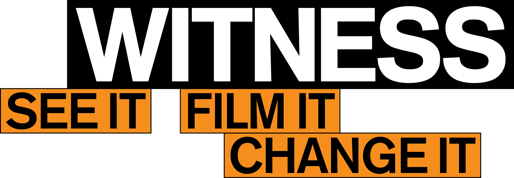

# EchoWatch – Documenting Anti-Igbo Hate Speech in Nigeria’s 2023 Elections

## Project Overview

- **Project Title:** EchoWatch – Documenting Incidents of Anti-Igbo Hate Speech in Nigeria’s 2023 Elections  
- **Cohort Member:** Godstime Agho  
- **Duration:** November 2024 – June 2025  
- **Location/Communities/Platforms Engaged:** Primarily X.com; Igbo communities, civic actors, digital rights defenders, journalists, and researchers  

### Brief Summary
EchoWatch is a public interest technology project focused on identifying and documenting incidents of hate speech targeted at the Igbo ethnic group during Nigeria’s 2023 general elections. The project primarily monitored online platforms—particularly X.com—to track and classify hate speech patterns and raise awareness of the impact of ethnic digital violence. It contributes to longer-term efforts to counter digital harm and protect democratic participation.

---

## What We Did & Why It Mattered

### Key Objectives
- Identify and document hate speech incidents targeting the Igbo ethnic group during the 2023 elections  
- Build a structured dataset for future research and advocacy  
- Raise awareness on how hate speech fuels voter suppression and ethnic tension  

### Activities
- Conducted a review of hate speech lexicons and prior documentation efforts  
- Collected and categorized over 15 hate speech instances from X.com  
- Conducted three expert interviews with investigators and analysts  
- Classified and archived tweets based on type, context, and platform  
- Created a GitHub repository to host the dataset for collaboration and future use  

### Major Results & Impact
- Developed a dataset with hate speech samples, including statements, sources, and contexts  
- Built capacity in hate speech research, digital ethics, and documentation  
- Highlighted how ethnic profiling and disinformation affected political participation  
- Received valuable feedback from mentors and collaborators on the project’s significance  

---

## Reflections

**Key Challenges**
- Identifying keywords was tricky due to subtle or coded language  
- Tool limitations: cost and complexity of scraping tools required reliance on open-source/manual tracking  
- Narrowed scope to X.com for consistency and focus  

**Lessons Learned**
- Start small—capturing fewer but stronger examples is more impactful than scattered data  
- Collaboration and mentorship are invaluable  
- Ethical documentation is essential when working with sensitive material  

**Community Feedback**
- Interviewees and collaborators emphasized this work was long overdue and welcomed the dataset  

---

## What’s Next?
Yes, the project will continue in a phased manner, aiming to expand the dataset for future elections and national incidents where ethnic hate resurfaces.  

**To sustain or scale this project, we need:**  
- Access to better scraping and data visualization tools  
- Possible recruitment of trained data collectors  
- Institutional or academic partnerships for validation and reach  
- Support to make this dataset public-facing and interactive  

---

## Dataset Sample

Below is a preview of documented hate speech instances (full dataset in repository):  

| Handle       | Text from the tweet                                                                                                                                                 | Hate Speech Type      | Date       |
|--------------|----------------------------------------------------------------------------------------------------------------------------------------------------------------------|-----------------------|------------|
| @example1    | "Let 2023 be the last time of Igbo interference in Lagos politics..."                                                                                                | Ethnic Profiling      | 2023-03-20 |
| @example2    | "Sisi Yemmie and her husband were prevented from voting in Lagos because they look like Igbo people."                                                                | Discrimination        | 2023-03-18 |
| @example3    | "Rejecting Peter Obi and his demonic supporters this weekend is a national assignment..."                                                                            | Incitement/Dehumanize | 2023-02-23 |
| @example4    | "Gbadebo Rhodes-Vivour is an IPOB supporter; he must not get close to Lagos governor seat."                                                                          | Disinformation/Incite | 2023-03-10 |
| @example5    | "Heartbreaking that MC Oluomo is threatening the Igbo people in Lagos, warning them not to vote against APC—why is nothing being done to address it?"                | Incitement/Threat     | 2023-03-17 |

---

## Media/Documentation
- **Excel Dataset:** `hate_speech_dataset.xlsx`  
- **Interview Summaries:** On file (unpublished)  
- **Working Documents:** Stored in Google Drive project folder  

---

## Contributing
We welcome contributions to expand and refine the dataset or improve documentation.  
Please read our detailed [Contributing Guidelines](./CONTRIBUTING.md) for step-by-step instructions.
Also read our detailed file [Main-Ideal](./MAIN-README.md) for why this project.  

---

## Links
- GitHub Repo: [EchoWatch](https://github.com/Gtstride/echowatch)  
- To be added: Project Website  

---

## Acknowledgment
Special thanks to the **WITNESS team** and collaborators for their mentorship, guidance, and encouragement throughout this project.  

---

  
  

